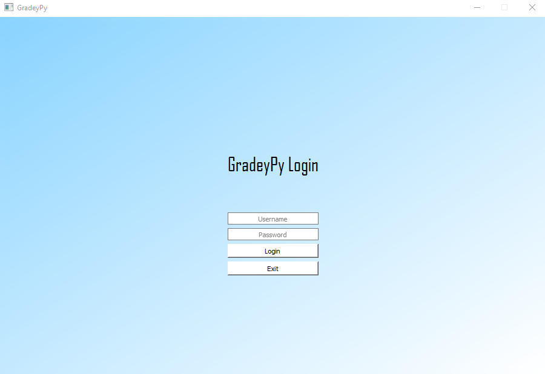
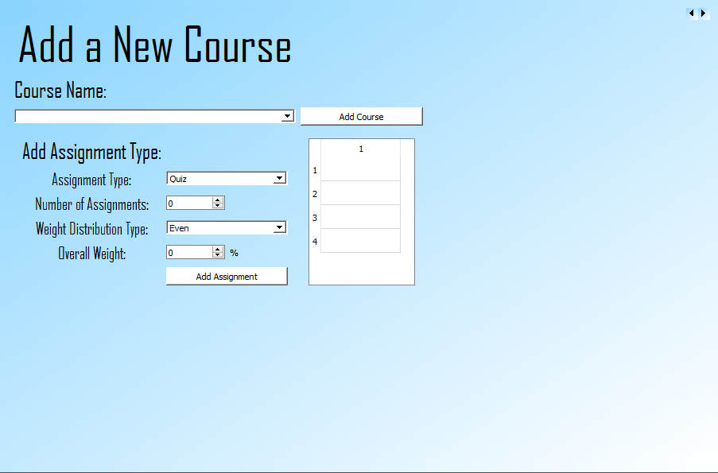

# **GradeyPy**
## Vers 1.0: A simple terminal grade calculator that calculates grades for different courses with various assignment types.

### Performs the following:
- Save & Loads data that user manipulates
- Allows for custom assignment types and course/classes
- Takes into account of even weighing distribution, staggered weighing, or dynamic weighing
- Considers if final has a dynamic grade
- Allows for what-if grading and calculates grade based off new input
 
### Bugs to fix/features to implement in upcoming version:
- Re-work grade calculation
- Implement GPA (College-level GPA) predictor
- Login System
- Foundational UI

 
## Vers 2.0: A simple program grade calculator that allows users to calculate their grades for different classes in a UI environment 

### Login Page:

### Main Menu:

### Add Course page:

